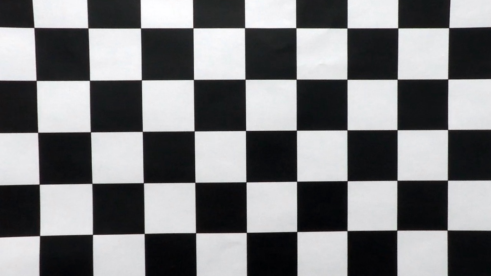
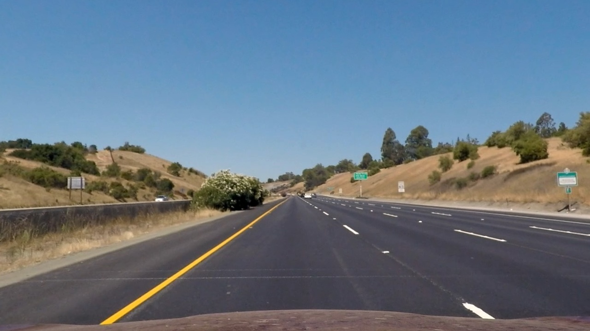
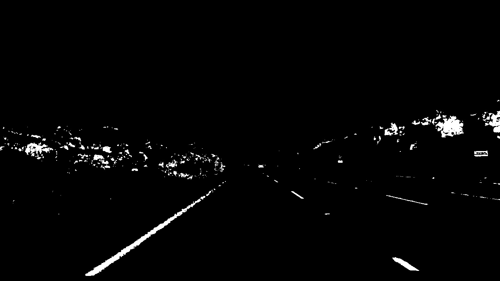
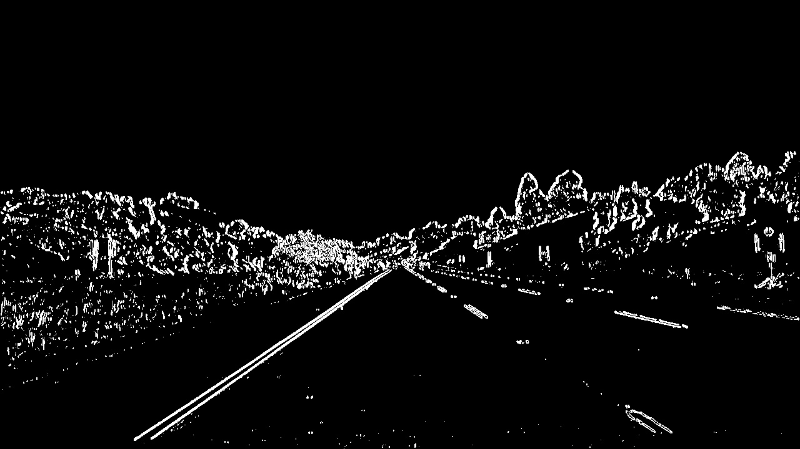
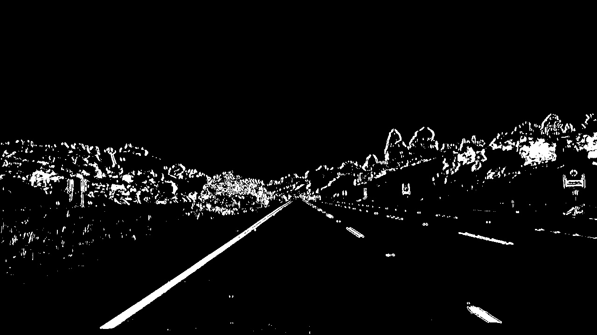
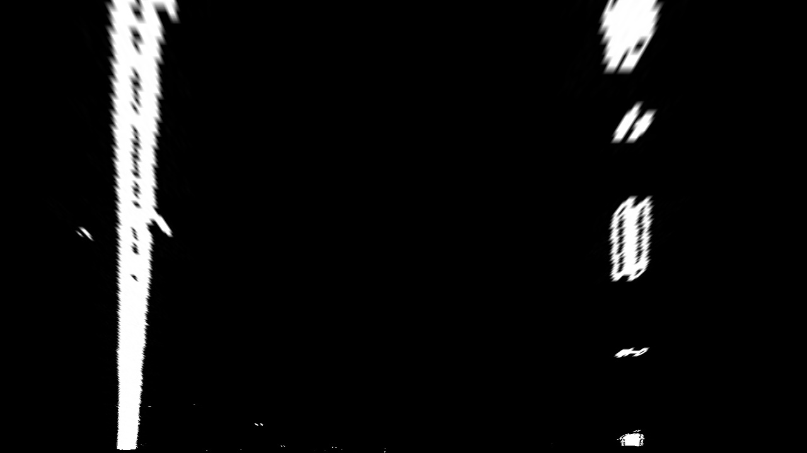
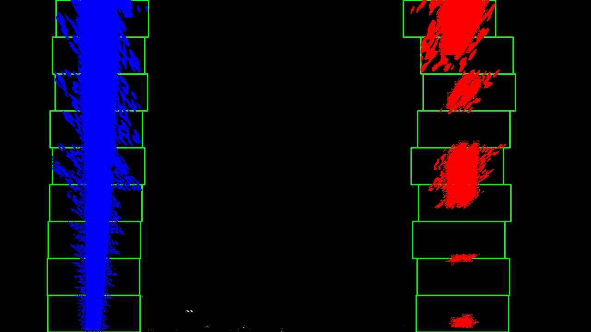
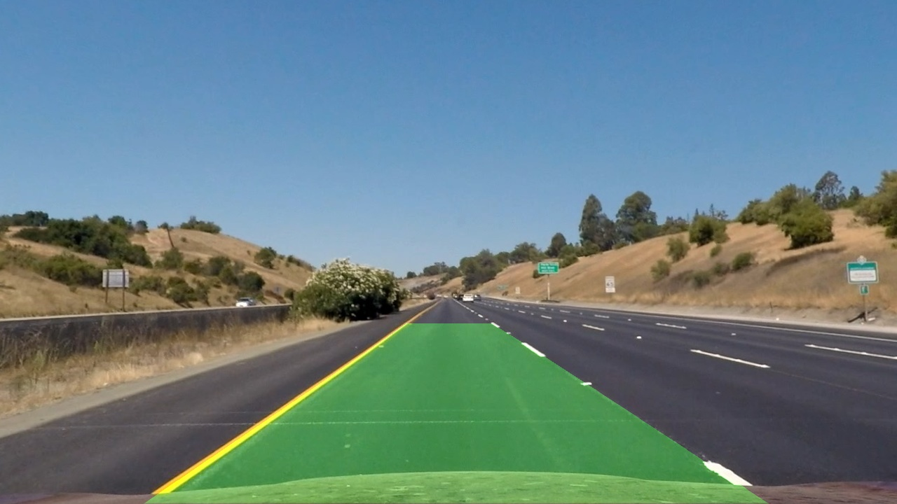

## Advanced Laneline Finding Project

---

**Advanced Lane Finding Project**

Finding lane lines is the first important thing to do when a self driving car drives on a road. With a camera on front of the car and a series of computer vision techniques, the lane line can be well detected and calculated for the self driving car system.

Following is the pipeline for the whole algorithm.

1. Camera calibration
2. Image undistort
3. Color space threshold and Gradient space threshold
4. Perspective transform
5. Laneline curve obtain using slidwindow with histogram
6. Radius of curvature calculate
7. Info and laneline drawn to the original image

---

### Camera Calibration

Camera lens can cause the distortion of the light around the edges.These distortion will cause the shape and position change of the lines in the image. Self driving car is really important with precision. With camera calibration we can fix this.The calibration can be done with a known standart chessboard images and the distorted chessboard images taken with the camera. The calibration parameters can be calculated through the process.

The code for this step is contained in the second and third code cell of the Jupyter notebook of Advanced Lane Line Finding Test.

I use a series of chessboard images which are taken from different angles and distance.I use opencv findcorner function to get all the important corners of the chessboard to form the Imgpoints. The Objpoints are standard and can be prepared. When we got the Imgpoints and Objpoints, we can use the opencv *calibrateCamera()* function to get the calibrationmatrix. I store this matrix in a pickle file for later use.
When we got the calibrationmatrix, we can use the opencv undistort function to undistort our img. we can see the following results for chessboard.

### Pipeline (single images)

#### 1. Provide an example of a distortion-corrected image.
I save the calibrationmatrix data through pickle. For the real road images,Ｉload the data from pickle and use the opencv undistort function to get the undistort image. The following is an example for the road image.

#### 2. Threshold of color and gradient combined
The lanelines are special yellow and white colors and also edges with big gradient change. With color and gradient threshold combined, we can get a whole threshold to get what we want.
##### Color Threshold
Color can be more convinent dealt with in HLS colorspace.I got experience from the porject one with the yellow and white threshold and used those threshold parameters for thersholding. 
Following is one example for such threshold.

##### Gradient Threshold combined
Gradient of color intensity can change quickly by edges. Lanelines have this pattern can be used to threhold. I tried Sobel_x,Sobel_y,Sobel_mag,Sobel_direction. The Sobel_X is used for main use. Other three are combined using & for threshold.
Following is one of the example.

##### Color and Gradient Threshold combined
Color and Gradient both got important needed information, with these two method combined, we got better result.
Following is one of the example.

#### 3. Perspective Transform
Camera is installed in the front of the car. The images show that the road will reach to one point in the center. But the best perspective to calculate and view the whole driving picture is from the 'birds eye view'.So we have to transform the perspective to the bird's eye view. Just like the camera calibration method, we can get the points before transform as src, we can get the points after transform as obp. We can get the transformmatrix through the srcp and objp. After that I save the matrix for later use. 
Following is one of the example for warp.

#### 4. Identifiy lane-line pixels and fit their positions with a polynomial
##### Slidewindow method
After a series of camera undostort,color and gradient threshold,perspective transform, we got the image that we care most about. Histogram method is the method we use to detect the most intense x position of the image which inffers as the edge. 
After that we use a sliding window function to search the image from bottom to up for the left lines and right lines. After the iteration, we can get the needed Left_x,Left_y points for the left laneline,Right_x,Right_y points for the right laneline.
Following is an example after the lanesearch using sliding window.

##### Polyfit method
When we got the needed points, we can use the fit_poly function to get the left_fit,right_fit.

#### 5. Radius of curvature of the lane and the position of the vehicle with respect to center.

When we got the important left_fit,right_fit parameters. We can calculate the curvature of the two lines using the following function.
   
    left_curverad = ((1 + (2*left_fit[0]*y_eval + left_fit[1])**2)**1.5) / np.absolute(2*left_fit[0])
    right_curverad = ((1 + (2*right_fit[0]*y_eval + right_fit[1])**2)**1.5) / np.absolute(2*right_fit[0])
And the position of the vehicle with respect to center is assume that the camera is assembled on the center of the car, the position can be calculated using the following function.

    middle_line =(left_line+right_line)/2
    deviation = (middle_line- vehicleCenter)*xm_per_pix
One thing needed to take into consideration is the pixel world and the real world. I used the suggeste parameters from the tutorial.
    
    ym_per_pix = 30/720 # meters per pixel in y dimension
    xm_per_pix = 3.7/700 # meters per pixel in x dimension

#### 6. Draw lanelines on the original image
When we got the left_fit and right_fit parameters. We can draw the two lines in the blank sheet and warp this image using the previous M_inv matrix. After that we combine the original image and the warped lanelines using opencv addWeight function.
Following is an example.

### Pipeline (video)
I use the image process pipeline on the project video.The following is the processed video.

Here's a [link to my video result](video_output/project_video.mp4)

---

### Discussion

#### 1. Problems I face
The Tunning of all the parameters for threshold and the parameters for slid window search is a little tricky work. For every video, there may be a best tunning parameters. It is difficult to  find a solution that suits for all.

#### 2. Potential method
The mix of the previous line information can be used to make the search method more efficient and better for showing in the video.
A adaptive method can be used for different video or situation.
Advanced methos my be conventional method that i will learn later.

This is not an easy project for me, but after i found the result of my video, it is still very encouraging.

